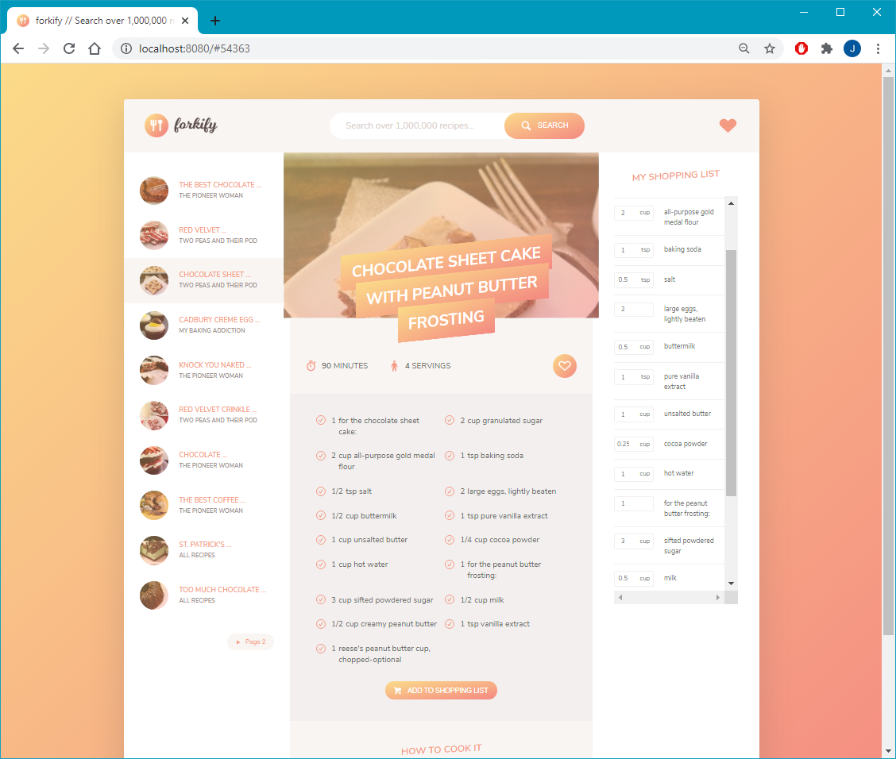

# forkify
Forkify - Foodie Project with API calls - Udemy hands on

This project build with JavaScript on node.js environment. 
This application will fetch food recipes based on the keyword serach using the API calls.

### Dependencies

"devDependencies": {
    "@babel/core": "^7.11.6",
    "@babel/preset-env": "^7.11.5",
    "babel-loader": "^8.1.0",
    "html-webpack-plugin": "^4.5.0",
    "webpack": "^4.44.2",
    "webpack-cli": "^3.3.12",
    "webpack-dev-server": "^3.11.0"
  },
  "dependencies": {
    "axios": "^0.20.0",
    "babel-polyfill": "^6.26.0",
    "core-js": "^3.6.5",
    "fractional": "^1.0.0",
    "regenerator-runtime": "^0.13.7",
    "uniqid": "^5.2.0"
  }

  The Forkify App

  
